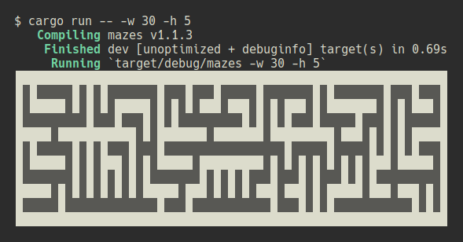

# Mazes

_This repository is a university assignment_



# Description

A tool for generating random mazes using a modified Kruskal algorithm.
The program uses the graph data structure implemented in `graph` crate.

The `graph::Graph` type stores data in the form of adjacency matrix, type is generic, enables dynamic insertion of nodes and edges, and implements iterators.

# Instructions

_The following instructions require the Rust toolchain._

To compile:

```
cargo build --release
```

To test:

```
cargo test
```

To run:

```sh
# debug with default maze size
cargo run

# to show help
cargo run -- --help

# release with custom maze size
cargo run --release -- -w 30 -h 5
```
